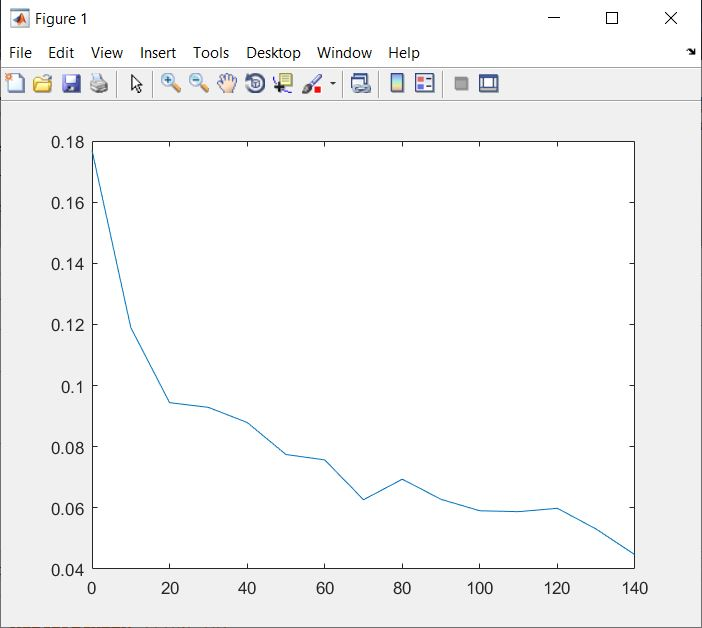

# Part2: Multi-Path channel optimal receiver

## MultiPathChannel
Generates a random complex normal distributed channel coefficients that exponentially decay with time and are in the form of a triangular matrix as described below.

## MultiPathBER
Implements an optimal receiver with inverse H (channel coefficients matrix) and returns BER for a given noise power No, and using Eb=1.

## MultiPathBench
Computes the BER for various SNRs and compares them

